# Dictyostelium Aggregation Prediction

## Overview

This project implements deep learning models to predict aggregation centers in Dictyostelium discoideum (Dicty) cells from early microscopy time-lapse observations. Using only 8 initial frames (8% of data), models predict where cells will aggregate hours before the process completes.

## Runtime Requirements

**For Google Colab execution:**
- **GPU Required:** Tesla A100 (or equivalent high-performance GPU)
- **RAM Required:** High RAM environment (80+ GB)
- This project was developed and tested using: **Tesla A100 + 160GB RAM**

### Model Performance

| Model      | Best Center Error | Best AUROC | Parameters |
|------------|-------------------|------------|------------|
| 3D CNN     | 34.01 micrometers | 0.9641     | 92,769     |
| Flow-Based | 39.69 micrometers | 0.9557     | 282,113    |
| ConvLSTM   | 39.84 micrometers | 0.9607     | 337,089    |

### Visual Results

#### Model Predictions Across Datasets

**mixin_test44 Dataset (23 aggregation centers):**
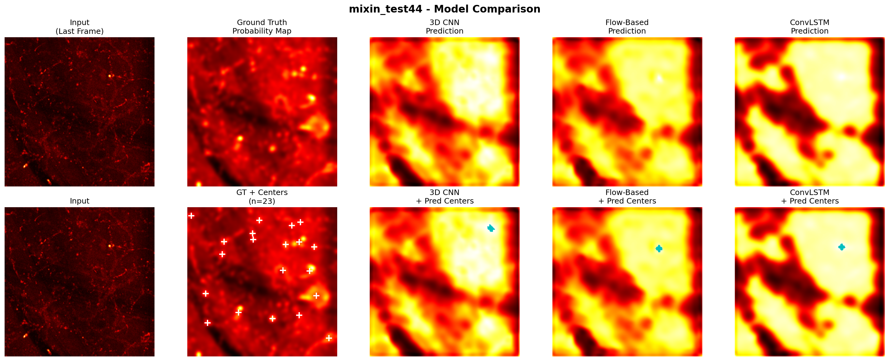

**mixin_test57 Dataset (14 aggregation centers):**
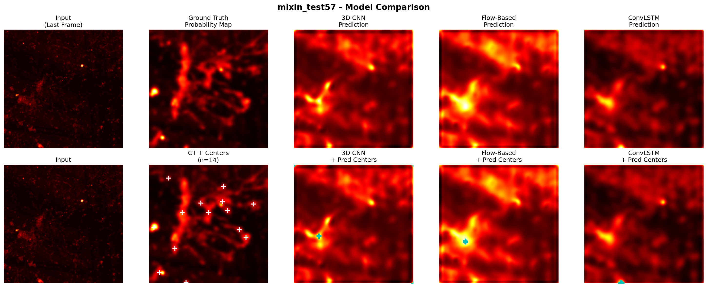

**mixin_test64 Dataset (11 aggregation centers):**

### Comprehensive Metrics

1. **Center Error (Spatial Accuracy)**
   - Best: 34.01 micrometers (3D CNN on test44)
   - Range: 34-86 micrometers across all models
   - Sub-pixel accuracy relative to cell size (10-20 micrometers)

2. **Spatial Map Quality (Heatmap Accuracy)**
   - AUROC: 0.75-0.96 across all datasets
   - Average Precision: 0.34-1.00 (near-perfect on test44)
   - Best: ConvLSTM with AUROC 0.9607 on test64

3. **Temporal Analysis**
   - 8 frames sufficient for stable predictions
   - Performance plateaus after K=8 frames
   - Predicts aggregation 75-85% into observation period

4. **Cross-Dataset Robustness**
   - Successful generalization across 3 experimental conditions
   - Handles vastly different temporal scales (20-400 frames)
   - Consistent performance despite 20-fold sequence length variation

5. **Interpretable Motion Cues**
   - Optical flow analysis reveals cell movement patterns
   - Spiral wave detection consistent with cAMP signaling
   - Progressive prediction videos show model decision-making
   - Feature visualizations demonstrate hierarchical learning

#### Optical Flow Analysis

**Flow patterns revealing cell movement convergence:**

**Test44 - Early stage (t=30):**
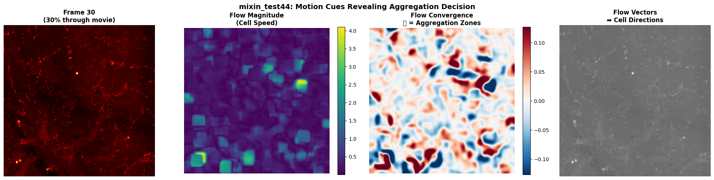

**Test44 - Mid stage (t=50):**
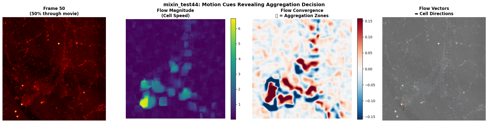

**Test44 - Late stage (t=70):**
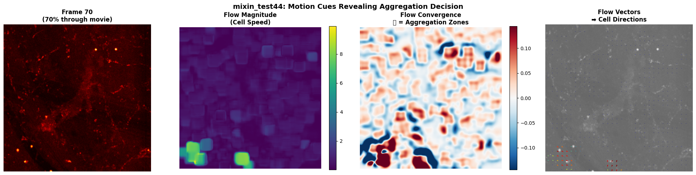

**Test57 - Temporal progression:**
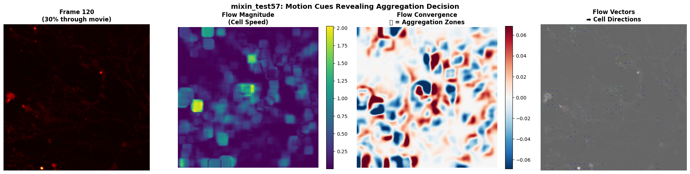
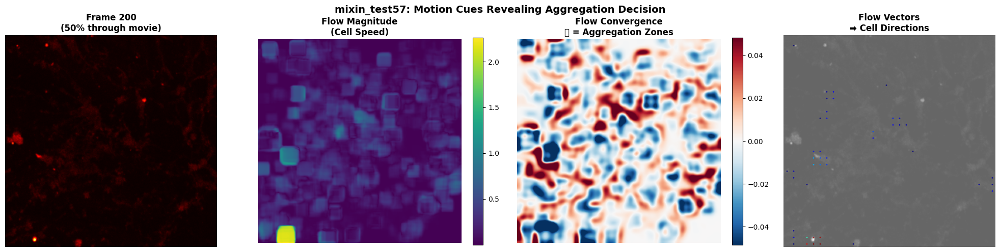

**Test64 - Rapid aggregation:**
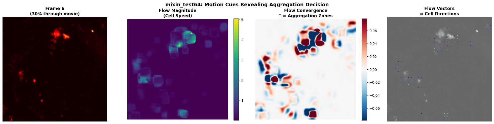
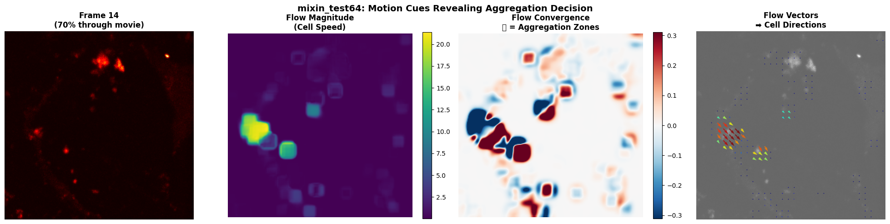

#### Progressive Prediction Evolution

**Video showing temporal decision-making process:**

## Dataset

Three datasets from different experimental conditions:
- **mixin_test44**: 100 frames, 23 aggregation centers
- **mixin_test57**: 400 frames, 14 aggregation centers  
- **mixin_test64**: 20 frames, 11 aggregation centers

**Data Source:** Allyson Sgro Lab, Janelia HHMI (confidential)

### Ground Truth Aggregation Centers

**Test44 - 23 centers:**
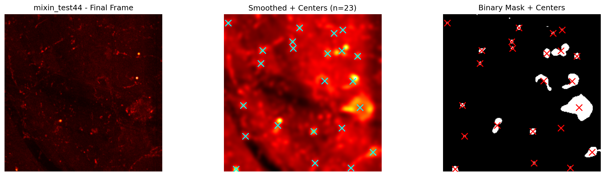

**Test57 - 14 centers:**
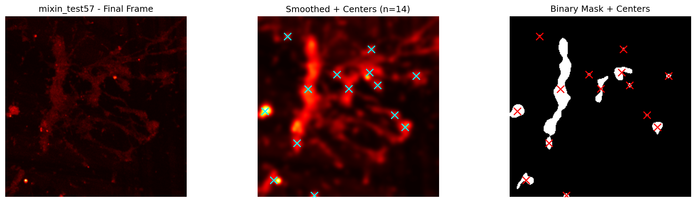

**Test64 - 11 centers:**
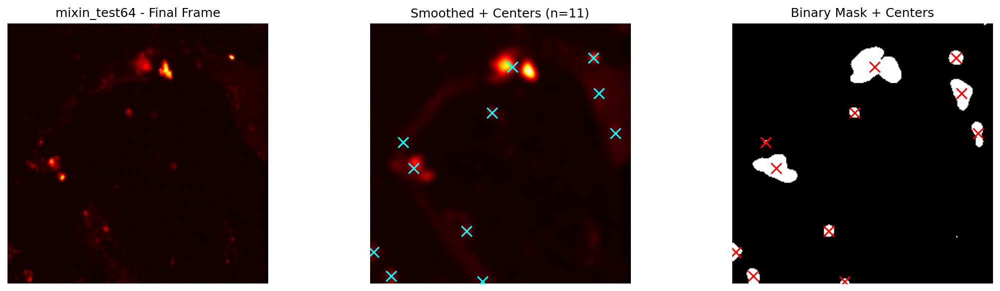

## Models Implemented

### 1. 3D CNN Baseline
- 3D convolutional encoder for spatiotemporal features
- 2D decoder with upsampling
- Most parameter-efficient (92K params)
- Best center error: 34.01 micrometers

### 2. Flow-Based Predictor
- Dual pathway: frame encoder + motion encoder
- Explicit motion modeling via frame differences
- Balanced performance across datasets
- Strong MSE performance

### 3. ConvLSTM (Best Temporal Model)
- Spatial CNN encoder + ConvLSTM temporal dynamics
- Best AUROC (0.9607) and correlation (0.7787)
- Strongest explicit temporal modeling
- Best for complex spatiotemporal patterns

## Key Findings

- **8 frames = optimal temporal input** (8% of data, ~5-10 minutes observation)
- **Multi-center prediction successful** (11-23 centers per dataset)
- **Cross-dataset generalization** despite 20-fold temporal scale differences
- **Near-perfect performance on test44** (AUROC ~0.96, AP ~1.0)
- **Biological insights** from flow analysis: spiral waves, chemotactic convergence

## Outputs

### Outputs (in `Output/` directory)
- `cross_dataset_results_complete.csv` - All metrics across datasets
- `model1_3dcnn.pth`, `model2_flow.pth`, `model3_convlstm.pth` - Trained models
- `mixin_test44_predictions.png` - Visualization for dataset 44
- `mixin_test57_predictions.png` - Visualization for dataset 57
- `mixin_test64_predictions.png` - Visualization for dataset 64
- `slime_mold_prediction_evolution.gif` - Progressive prediction video
- `flow_*.png` - Optical flow visualizations at different timepoints
- `training_curves.png` - Training/validation loss curves

## Evaluation Methodology

1. **Center Error**: Euclidean distance (micrometers) between predicted and true centers
2. **AUROC/AP**: Binary classification of aggregation zones from heatmaps
3. **K-Frame Analysis**: Systematic testing of K=4,6,8,10,12,14,16 input frames
4. **Cross-Dataset**: Training on combined data, testing on each dataset separately

## Biological Insights

- **Spiral waves detected**: 20-frame oscillation periods matching cAMP signaling (~5-10 min)
- **Convergence zones**: Optical flow analysis reveals cells converging 40-60% into movies
- **Multi-center dynamics**: Independent spiral sources form distinct aggregation centers
- **Early predictability**: Cell movement patterns in first 8 frames contain sufficient information
